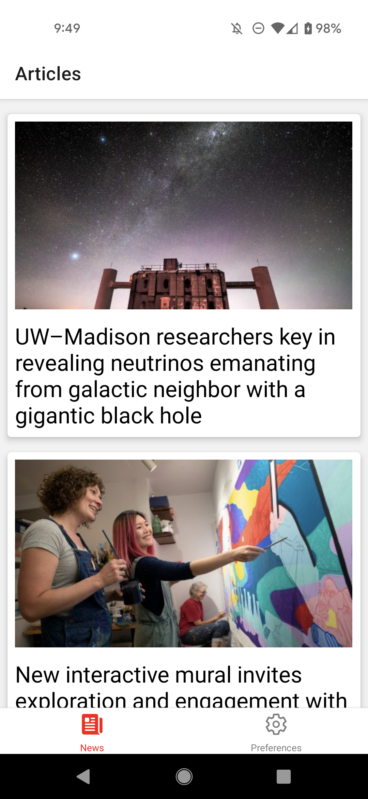
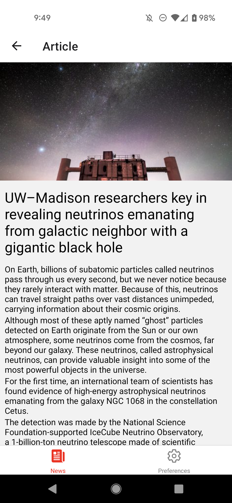
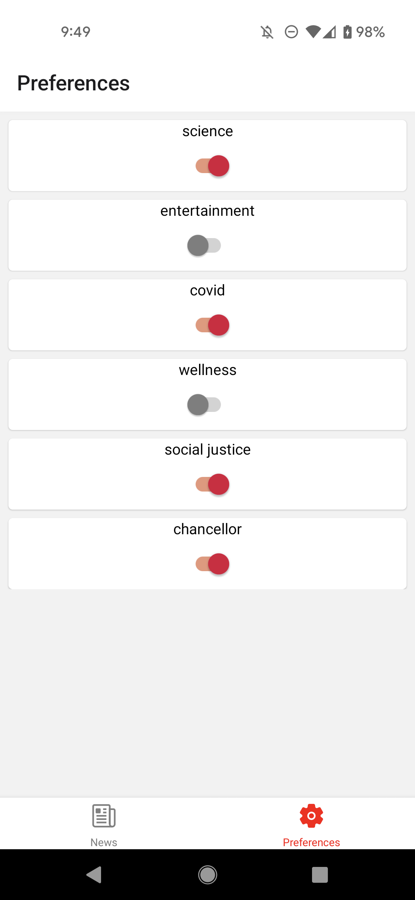

[](https://classroom.github.com/online_ide?assignment_repo_id=10783682&assignment_repo_type=AssignmentRepo)

# CS571-S23 HW09: Badger News

Welcome to Badger News! For this assignment, you will complete a mobile application that allows badgers to get and customize news from their university using just a few taps on their phone!

Following, you will answer questions related to mobile design and design patterns. **Make sure to complete both parts of this assignment.**



## Badger News

The starter code provided to you was generated using [expo](https://expo.dev/) and all the necessary libraries for [react navigation](https://reactnavigation.org/) have already been added. See the `package.json` for details. **You should _not_ re-run the expo init command**. Instead, in this directory, simply run...

```bash
npm install
npm start
```

To test your app, you have a few options. If you have a smart device, I would recommend using the expo app for [iOS](https://apps.apple.com/us/app/expo-go/id982107779) or [Android](https://play.google.com/store/apps/details?id=host.exp.exponent&hl=en_US&gl=US). You can scan the QR code using your phone, or you can launch commands via the terminal. Otherwise, you can use an emulator (such as [AVD](https://developer.android.com/studio/run/emulator)). Do not use the web browser to test your code; you must test on Android or iOS!

Note that we are writing code in JavaScript for React Native; if you begin writing code in Objective-C, Swift, Java, or Kotlin you are likely doing something _very_ wrong!

### API Notes

All data can be retrieved via API calls to `https://www.cs571.org/s23/hw9/api/`. A brief overview of the API is provided below. There is no further documentation as this API only supports `GET` requests. Please use Postman to explore the API in greater depth.

`https://www.cs571.org/s23/hw9/api/news/articles` returns a short summary of each of the news articles including an `id`, `img`, `title`, and `tags`. You may assume the `id` is unique for each article.

`https://www.cs571.org/s23/hw9/api/news/articles/:articleId` returns the details for a particular article id, e.g. `:articleId` as `3`. **This endpoint is intentionally slow.** These details include all of the properties of the short summary as well as an additional `body` property containing an ordered array of body paragraphs.

### 1. React Navigation

Allow the user to navigate between two tabs: a tab for "News" and a tab for "Preferences". I would recommend using a BottomTabNavigator in `BadgerTabs.js` to navigate between screens for `BadgerNewsScreen.js` and `BadgerPreferencesScreen.js`. You do not need to add any options, icons, or styling to the tabs. **You must use React Navigation for this requirement.**


### 2. Display News

Fetch the short news articles summaries from `https://www.cs571.org/s23/hw9/api/news/articles` and display them to the screen, including their image and title text. I'd recommend creating a component such as `BadgerNewsItemCard` to display each short summary as a card. Use the article's `id` as the unique key.


### 3. Read News Article

When a news story is selected, the user should be able to see the header image and read the additional body paragraphs about that story _in a Modal_ or _in a nested Stack Navigator_. You may choose which of these you want to use! Using a modal, the article would appear as a secondary overlay; using a Stack Navigator, the article would appear on a seperate screen. If you use a Stack Navigator, only one header bar should be shown. The demo video uses a _nested Stack Navigator_.

In either case, the user should be displayed a message along the lines of "The content is loading!" while waiting for the body paragraphs to load. Furthermore, loading the text content of the article must be _animated_. It may fade in, grow in size, or do some animation using `Animated` or some other third-party library. After finishing reading the article, the user should be able to to return to the list of short summaries.



### 4. Apply Preferences

The user should be able to apply their preferences via the "Preferences" tab. By default, the user should opt in to all content. However, the user should be able to toggle preferences on/off. If the user has a preference toggled off, _any_ news story with that tag should _not_ be displayed to the user. If the user's preferences are so restrictive that there are no articles to be displayed, a message should be displayed saying so (it is also okay for this message to be displayed while the short summaries are loading).

I would recommend using the `BadgerPreferencesContext.js` to store the users preferences. e.g. it may look like this...

```javascript
{
    "chancellor": true,
    "campus": false,
    "science": true,
    "climate": false
}
```

You will need to create this list of unique tags yourself. You may choose to do this by running `reduce` over the list of articles and constructing an array of unique tags, but how you choose to do this is up to you.

Furthermore, I would recommend using `BadgerPreferenceSwitch.js` which has already been implemented for you. This component is a wrapper around the `Switch` component and takes 3 props...

- `initVal`: (optional) `true` or `false` if the switch should be on/off by default
- `prefName`: the name of the preference, e.g. "wellness"
- `handleToggle`: a 2-parameter callback function called on load and whenever the switch is toggled. The first parameter will be the preference name, and the second will be the _new value_ of the switch. e.g. if the user toggles the covid preference off, `handleToggle` will be called with the first argument of "covid" and the second argument of `false`.



### Other Notes

You may assume that each article has a unique `id`. You may _not_ hardcode the number of articles _or_ the names of preferences _anywhere_! Being a busy publishing firm in Madison, these may vary from day-to-day, and we should _not_ assume that they remain the same.

**Tip:** Looking to get your [Third Party Library](https://canvas.wisc.edu/courses/324228/assignments/1691946) assignment done? Use a library such as [Ionicons](https://ionic.io/ionicons) or [Font Awesome](https://fontawesome.com/) to add icons to your tabs. **Using icons is a suggestion, not a requirement.**


### Submission Details

In addition to your code, **you will also need to submit a video recording of your app**. Like the demo video, it should cover all the tasks below. Please thoroughly demonstrate all tasks to showcase the capabilities of your app.

**Please embed your recording as a _Kaltura video_ as a part of the assignment submission.**

#### Tasks

- Show the short summaries of all news stories.
- Read 2 specific news stories and navigate back to the main news screen.
- Update the preferences to exclude 2 preferences and show that the news items have changed accordingly.
- Update the preferences to exclude all preferences to show the warning message.

---

## Mobile Design and Design Patterns

The questions below will ask you about the mobile design and design patterns used in the Badger News app that you had just implemented. For each question, please write a response grounded in content from the "Mobile Design" lecture, the "Design Patterns" lecture, or other reputable sources. I would expect 2-4 sentences per response.

1. In what way(s) is Badger News (implemented in this homework) more mobile-friendly than Badger Bakery (implemented in the last homework)?

Some of the factors that make Badger News more mobile-friendly would be animation, support for gesture, bar and stack navigation. Unlike Badger Bakery where we have to use next and prev to navigate pages, we can use bottom tab to navigate around. We can also read the article either with modal or with stack navigation. In Badger Bakery, there is no animation; hence the application is quite unappealing. In Badger News app, I have implemented the loading text to blink as it is loading.

2. Name a perceptible affordance within your app, what does it do? Then, name a hidden affordance that _could_ be implemented, what would it do?

One of the perceptible affordance would be the bottom naviagtion. I beleive it's quite obvious for people as symbol of navigation between pages. People can use it to naviagte between perference page and article page. The hidden affordance may be bringing up the stack navigation page as I tap on one of the cards. It would bring up the full article.

3. One of the design paradigms that we discussed in class was "metaphoric design". What could be done to make our app design more metaphoric? What would be the benefits and consequences of a more metaphoric design?

We can sort the articles based on the tags that they are associated to and create like mini clusters where it would be labeled according to its tag but also have background image associated to their tag (for science -> space, campus -> UW-Madison city wide picture). In this way, instead of needing the perference page, the readers can directly head to section they want to read and they would be easily able to locate it since the background image is associated to what ordinary people might perceive when they think of that specific tag.

4. Briefly describe the business goal(s) and posture level of this application. Then, what is a task a user may try to accomplish? How does your app support this task?

One of the business goal would be to increase the amount of time users spend on the app, as well as the frequency of their visits. This can be achieved through features like personalized content recommendations, push notifications, and social sharing. Another one would be to build brand recognition and awareness among users. This can be achieved through effective branding, marketing, and partnerships with other companies or influencers. The Badger News app would be the news app that is designed to provide users with up-to-date information on current events. It would be in major competition agaisnt some of wisconsin's news app. Most of the news app would follow similar structure that is laid out in card like format so that the users can easily access news article and would need to have some type of naviagtion to filter through tags. Our app have dedicated perference page where we can toggle the switch to filter through the tags. We also have bottom navigation to switch between main article page and perference page.
